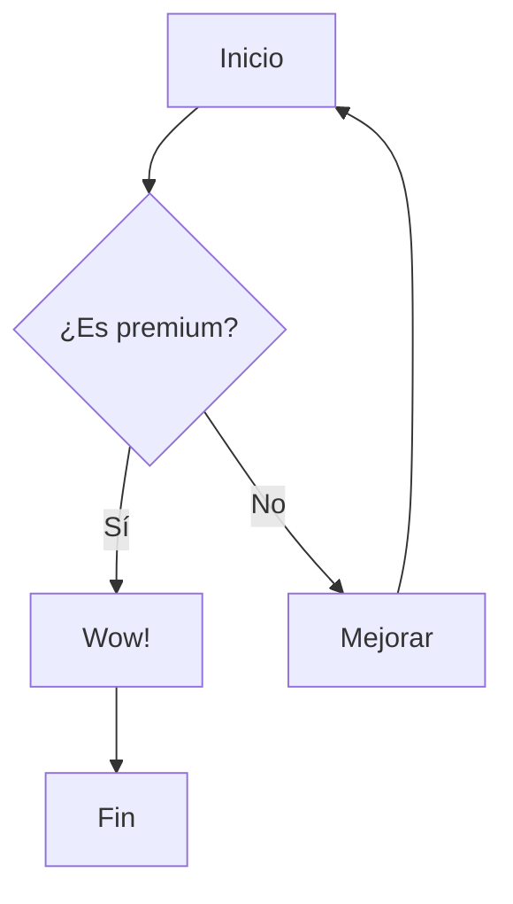

# Mermaid Diagrams

El componente `<Mermaid />` permite integrar diagramas complejos directamente en tu documentación usando una sintaxis basada en texto fácil de leer y mantener.

## Uso Básico

Puedes pasar el código del diagrama como `children` del componente.



```jsx
<Mermaid title="Flujo de Decisiones">
{`graph TD
    A[Inicio] --> B{¿Es premium?}
    B -- Sí --> C[Wow!]
    B -- No --> D[Mejorar]
    C --> E[Fin]
    D --> A`}
</Mermaid>
```

<Mermaid title="Flujo de Decisiones">
{`graph TD
    A[Inicio] --> B{¿Es premium?}
    B -- Sí --> C[Wow!]
    B -- No --> D[Mejorar]
    C --> E[Fin]
    D --> A`}
</Mermaid>

---

## Diagramas de Secuencia

Ideal para documentar flujos de autenticación o procesos de servidor.

<Mermaid title="Flujo de Autenticación">
{`sequenceDiagram
    participant U as Usuario
    participant S as Servidor
    participant D as Base de Datos
    
    U->>S: Enviar credenciales
    S->>D: Verificar usuario
    D-->>S: Usuario válido
    S-->>U: Token de acceso (JWT)`}
</Mermaid>

---

## Diagramas de Clase

Para documentar arquitecturas de código y relaciones de objetos.

<Mermaid title="Estructura de Clases">
{`classDiagram
    Animal <|-- Duck
    Animal <|-- Fish
    Animal <|-- Zebra
    Animal : +int age
    Animal : +String gender
    Animal: +isMammal()
    Animal: +mate()
    class Duck{
      +String beakColor
      +swim()
      +quack()
    }
    class Fish{
      -int sizeInFeet
      -canEat()
    }
    class Zebra{
      +bool is_wild
      +run()
    }`}
</Mermaid>

---

## Propiedades

| Propiedad | Tipo | Defecto | Descripción |
| :--- | :--- | :--- | :--- |
| `code` | `string` | - | El código del diagrama en sintaxis Mermaid. |
| `children` | `string` | - | Alternativa al prop `code` para pasar el diagrama. |
| `title` | `string` | `"Diagrama Mermaid"` | Título descriptivo en la cabecera del componente. |
| `className` | `string` | - | Clases CSS adicionales. |

---

## Características Premium

- **Auto-Theming**: El diagrama cambia automáticamente sus colores al cambiar entre modo claro y oscuro.
- **Interactividad**: Usa los controles en la cabecera para hacer zoom y explorar diagramas grandes.
- **Manejo de Errores**: Si hay un error de sintaxis, el componente mostrará un mensaje descriptivo sin romper la página.

> [!TIP]
> Puedes usar el [Mermaid Live Editor](https://mermaid.live/) para previsualizar tus diagramas antes de pegarlos en tu documentación.
